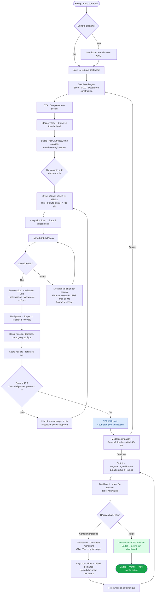
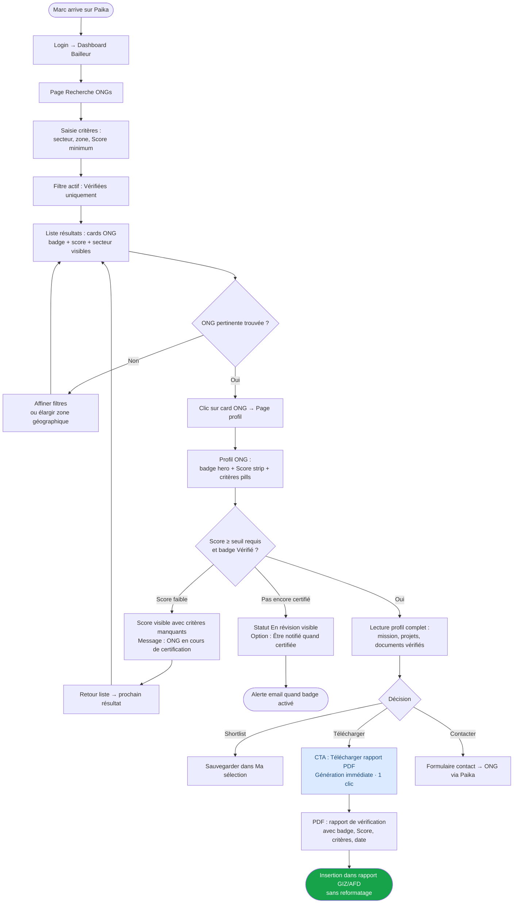
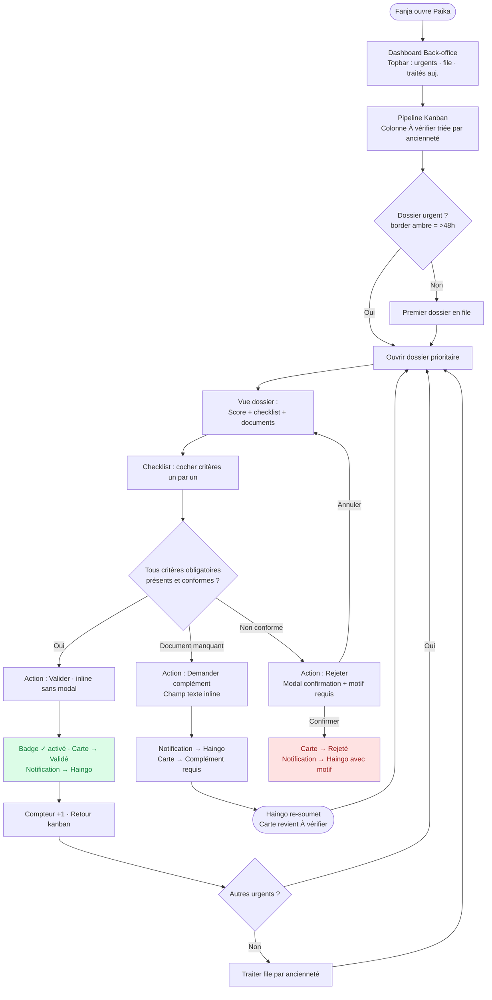

# UX Design Specification - Paika ONG Platform

**Auteur:** Paika
**Date:** 2026-05-01

---

<!-- UX design content will be appended sequentially through collaborative workflow steps -->

## Résumé Exécutif

### Vision Produit

Paika est une infrastructure de confiance régulée pour l'écosystème ONG malgache — plateforme web SaaS B2B + marketplace two-sided combinant certification ONG, Score de Transparence auditable, passerelle mobile money régulée, et interface bailleurs institutionnels dans un seul produit.

**Plateforme cible :** Web uniquement — navigateur desktop (Chrome, Firefox, Safari). Aucune version mobile, aucun responsive mobile. Les trois rôles (Agent, Bailleur, Back-office) accèdent via navigateur desktop exclusivement.

### Utilisateurs Cibles

**user_agent — Gestionnaire ONG (ex: Haingo)**
- Accès via navigateur desktop
- Tâche principale : créer et maintenir le dossier ONG, suivre la certification
- Priorité UX : formulaires guidés multi-étapes, progression claire du Score, reprise de session

**user_partner — Bailleur institutionnel (ex: Marc, GIZ)**
- Accès desktop institutionnel, usage professionnel
- Tâche principale : rechercher, évaluer et shortlister des ONGs certifiées
- Priorité UX : recherche rapide, confiance visuelle immédiate, export PDF

**back_office — Opérateur Paika (ex: Fanja)**
- Accès exclusivement desktop
- Tâche principale : traiter le pipeline de certification (8–12 dossiers/jour)
- Priorité UX : efficacité maximale, kanban fluide, zéro friction

### Défis UX Clés

1. **Trois expériences distinctes dans une codebase unique** — dashboards Agent/Partner/Back-office radicalement différents, routing et middleware séparés
2. **La confiance en 3 secondes** — Badge "✓ Vérifié" et Score de Transparence sont les signaux visuels primaires pour les bailleurs ; leur design est la proposition de valeur
3. **Formulaires longs sur desktop** — Multi-étapes avec sauvegarde auto, reprise de session sans perte de données
4. **États de transaction mobile money** — `pending → processing → completed/failed/timeout` lisibles et actionnables pour utilisateurs non-techniques
5. **Score progressif et motivant** — L'ONG voit exactement ce qui manque pour progresser sans se sentir bloquée

### Opportunités UX

1. **Score de Transparence comme signature visuelle** — Visualisation distinctive (barre de progression graduée, indicateurs par critère) reconnaissable dans les rapports bailleurs
2. **Pipeline back-office 2,5x plus efficace** — Kanban avec checklist intégrée remplace email + Excel pour Fanja
3. **"Dossier de confiance" bailleur-ready** — Profil public + export PDF conçus pour insertion directe dans les rapports GIZ/AFD sans reformatage

---

## Expérience Utilisateur Core

### Action Centrale Définissante

Le moment pivot de Paika est la **certification ONG** — quand une ONG obtient son badge "✓ Vérifié" après validation back-office. Tout gravite autour de ce moment :
- L'Agent construit vers ce moment (formulaire, documents, Score)
- Le Bailleur consomme ce moment (profil certifié, rapport PDF)
- Le Back-office produit ce moment (pipeline de vérification)

Actions primaires par rôle :
- **Agent** : soumettre/compléter le dossier ONG, consulter son Score et sa progression
- **Bailleur** : rechercher des ONGs certifiées, consulter un profil, télécharger le rapport PDF
- **Back-office** : traiter le pipeline de vérification (kanban), valider/rejeter/demander des compléments

### Stratégie de Plateforme

- **Web desktop uniquement** — navigateur desktop exclusivement pour les 3 rôles ; aucun responsive mobile
- **Navigateur uniquement** — pas d'application native ; @nuxt/ui + TailwindCSS, breakpoints desktop uniquement (`lg/xl`)
- **SSR Nuxt 3** — rendu serveur pour les pages publiques (SEO, performance) ; composants `.client.vue` pour les interactions browser-only
- **Résilience session** — sauvegarde automatique des formulaires, reprise à l'étape interrompue, gestion des timeouts réseau

### Interactions Sans Friction

- **Reprise de formulaire** — un Agent qui revient après interruption reprend exactement à l'étape où il s'est arrêté, données conservées
- **Score auto-recalculé** — aucune action requise ; se met à jour silencieusement à chaque événement déclencheur
- **Badge auto-géré** — suspension et réactivation sur paiement sans intervention back-office
- **PDF en 1 clic** — le bailleur télécharge le rapport de vérification sans workflow supplémentaire
- **Pipeline kanban** — Fanja voit l'urgence et l'état de chaque dossier sans ouvrir les détails

### Moments Critiques de Succès

| Moment | Utilisateur | Enjeu |
|---|---|---|
| Première visualisation du Score après soumission | Agent | Doit être lisible et motivant même si le score est bas — montrer la progression possible |
| Réception de la notification "✓ Vérifié" | Agent | Moment de fierté — déclenche la confiance dans la plateforme |
| Premier chargement d'un profil ONG certifié | Bailleur | La confiance se joue là — badge, Score, documents doivent inspirer en 3 secondes |
| Vue du pipeline back-office le matin | Back-office | Clarté immédiate sur les priorités sans avoir à chercher |
| Notification "paiement échoué" | Agent | Ne doit pas sembler punitive ; urgente mais bienveillante, avec chemin de résolution clair |

### Principes d'Expérience

1. **Confiance par la preuve, pas par les mots** — chaque élément UI renforce la crédibilité via des données factuelles (Score chiffré, date de certification, documents vérifiés)
2. **Progression toujours visible** — l'utilisateur sait à tout moment où il en est et quelle est la prochaine étape
3. **Résilience silencieuse** — les problèmes réseau sont gérés gracieusement, sans exposer l'erreur technique brute
4. **Densité pour les experts** — back-office et bailleurs obtiennent des interfaces denses et efficaces ; pas de sur-simplification
5. **Guidage progressif pour les débutants** — les agents sont guidés étape par étape sans être submergés par la complexité

---

## Réponse Émotionnelle Désirée

### Objectifs Émotionnels Primaires

| Utilisateur | Émotion cible | Phrase-clé |
|---|---|---|
| **Agent ONG** | Fierté + Légitimité acquise + Soulagement | *"Enfin reconnue. Je n'aurai plus à recommencer à zéro avec chaque bailleur."* |
| **Bailleur institutionnel** | Confiance + Sécurité professionnelle + Efficacité | *"Pour la première fois, je fais confiance à une plateforme pour ma due diligence."* |
| **Back-office** | Maîtrise + Clarté + Productivité sans stress | *"Tout est traité, rien n'est perdu, je sais exactement où en est chaque dossier."* |

### Cartographie du Parcours Émotionnel

**Agent ONG :**
- Découverte → Méfiance initiale ("encore une plateforme vide") → Curiosité à l'inscription
- Pendant → Concentration guidée (formulaire progressif) → Légère anxiété au Score provisoire bas
- Moment clé → Fierté et soulagement à la notification "✓ Vérifié"
- Retour → Confiance et appartenance (la plateforme travaille pour moi)

**Bailleur :**
- Découverte → Scepticisme professionnel ("est-ce fiable pour mon usage GIZ ?")
- Pendant → Efficacité croissante (filtre, profil, Score lisibles) → Confiance qui monte
- Moment clé → Décision en 2h au lieu de 3 jours → Sécurité professionnelle
- Retour → Fidélité (intègre Paika dans ses processus d'appels)

**Back-office :**
- Matin → Clarté immédiate (pipeline visible, priorités lisibles)
- Pendant → Flow de traitement sans friction → Sentiment de maîtrise
- Fin de journée → Satisfaction de l'avancement mesurable

### Micro-Émotions et Polarités

| Polarité | Émotion cible | Émotion à éviter |
|---|---|---|
| Confiance vs Scepticisme | Confiance par la preuve factuelle | Doute sur la neutralité du Score |
| Progression vs Blocage | Progression motivante du Score | Sentiment d'être bloqué sur un critère |
| Urgence bienveillante vs Punition | "Régularise maintenant — voici comment" | "Ton badge est suspendu" sans chemin de sortie |
| Maîtrise vs Chaos | Pipeline ordonné et lisible | Pile de dossiers sans priorité visible |
| Fierté vs Honte | Badge comme distinction positive | Score bas comme jugement de valeur |

### Implications Design

- **Confiance** → Données factuelles en avant (chiffres, dates, documents vérifiés) — pas de marketing claims
- **Progression** → Barre de Score graduée avec prochaine étape visible — jamais un score brut sans contexte
- **Urgence bienveillante** → Couleur amber (pas rouge) pour les alertes paiement + CTA "Régulariser" immédiat
- **Maîtrise back-office** → Kanban dense avec statuts colorés + métriques en tête de pipeline
- **Fierté agent** → Animation subtile au moment de la certification — moment mémorable, pas juste un changement de statut

### Ton et Voix

**Institutionnellement crédible + accessible** — ni froid comme un registre d'État, ni informel comme une app grand public.
- Pour les bailleurs : langage précis, professionnel, sans ambiguïté
- Pour les agents : chaleureux, encourageant, jamais condescendant
- Pour les erreurs : neutre informatif + chemin de résolution toujours visible

---

## Analyse UX & Inspiration

### Produits Inspirants

**MVola / Orange Money — interfaces mobile money malgaches**
- Patterns retenus : flow paiement 3 étapes max, confirmation montant visible, états transaction lisibles
- Application Paika : souscription abonnement et paiement aussi familiers que MVola pour les agents terrain

**GuideStar / Candid (US)**
- Patterns retenus : profil ONG structuré en sections claires, badge certification en haut de profil, Score avec détail des critères
- Application Paika : profil public ONG et Score de Transparence inspirés directement, localisés pour le contexte malgache

**Linear — gestion de pipeline**
- Patterns retenus : kanban dense et efficace, statuts colorés lisibles d'un coup d'œil, actions rapides sans ouvrir les détails
- Application Paika : pipeline back-office de vérification dossiers

**LinkedIn — profil professionnel avec signaux de crédibilité**
- Patterns retenus : complétion progressive avec indicateur de force, badges de vérification proéminents
- Application Paika : formulaire ONG multi-étapes avec indicateur de complétude, badge Vérifié distinctif

### Patterns UX Transférables

**Navigation & Structure :**
- Dashboards séparés par rôle — chaque rôle a son espace propre, sans contamination croisée
- Sidebar desktop, menu hamburger mobile — structure standard @nuxt/ui

**Interactions :**
- Sauvegarde automatique silencieuse — pas de bouton "Enregistrer" visible sur les formulaires multi-étapes
- Skeleton loaders plutôt que spinners — perçu plus rapide sur réseau 3G
- Toast notifications non-intrusives pour les succès (bas à droite)
- Confirmation modale uniquement pour les actions irréversibles

**Visuels :**
- Score de Transparence : barre de progression circulaire + critères détaillés — confiance et progression
- Badge "✓ Vérifié" : badge vert distinctif avec date de certification — crédibilité instantanée
- Statuts pipeline : couleurs sémantiques (amber = en attente, blue = en cours, green = validé, red = rejeté)

### Anti-Patterns à Éviter

- **Formulaire unique très long** — toujours découper en étapes avec progression visible, surtout sur mobile
- **Erreurs techniques brutes** — jamais exposer les codes Supabase ; toujours message humain + action de résolution
- **Redirection sans contexte** — après login, retourner vers la destination initiale via `?redirect=`
- **Score sans explication** — chiffre brut (45/100) sans critères crée de la frustration ; toujours montrer le "pourquoi" et le "comment progresser"
- **Notifications de suspension agressives** — amber discret + CTA, jamais alerte rouge sans chemin de sortie

### Stratégie d'Inspiration

**Adopter :** flow paiement type MVola (familier pour les agents), structure profil type GuideStar (crédible pour les bailleurs), kanban type Linear (efficace back-office)

**Adapter :** scores et badges GuideStar → localisés en critères ONG malgaches ; pipeline Linear → simplifié pour 1 opérateur

**Éviter :** complexité Airtable (trop de colonnes) ; gamification Duolingo (hors-ton pour infrastructure institutionnelle)

---

## Design System Foundation

### Choix du Design System

**@nuxt/ui 2.20+ + TailwindCSS** — déjà intégré dans le projet brownfield. Approche : système thémable avec composants custom pour les éléments différenciants de Paika.

### Rationale

- **Déjà installé** — zéro coût d'adoption, composants existants (Header, Card, OngList) déjà construits dessus
- **Composants éprouvés** — Button, Input, Form, Badge, Modal, Toast, Table, Dropdown couvrent 80% des besoins
- **TailwindCSS** — dark mode class-based, CSS custom properties HSL pour la palette Paika
- **SSR-compatible** — @nuxt/ui respecte les contraintes `.client.vue` vs `.vue` du projet
- **Responsive** — breakpoints `sm/md/lg` natifs pour web-first + mobile responsive

### Composants Standards (fournis par @nuxt/ui)

Authentification, formulaires multi-étapes, navigation sidebar/header, notifications toast, tableaux de données, modales de confirmation, badges de statut, dropdowns, inputs de recherche.

### Composants Custom à Créer

| Composant | Usage | Priorité |
|---|---|---|
| `ScoreTransparenceWidget` | Visualisation circulaire Score + critères détaillés | MVP |
| `BadgeVerifie` | Badge vert avec date de certification et statut | MVP |
| `PipelineKanban` | Colonnes back-office avec cartes dossiers | MVP |
| `TransactionStatusBadge` | États mobile money (pending/processing/completed/failed) | MVP |
| `OngProfileCard` | Carte bailleur avec Score, badge, actions | MVP |
| `StepperForm` | Formulaire multi-étapes avec progression et sauvegarde auto | MVP |
| `DocumentUploadZone` | Zone d'upload avec preview et statut de vérification | MVP |

### Tokens de Design

- **Couleurs sémantiques** : `--color-verified` (vert badge), `--color-pending` (amber), `--color-rejected` (rouge), `--color-score-high/mid/low`
- **Typographie** : hiérarchie desktop-first, lisible sur mobile sans zoom
- **Espacements** : système 4px base, densité élevée pour back-office, aérée pour profils publics

---

## 2. Core User Experience

### 2.1 Defining Experience

**L'expérience définissante de Paika :** *"Une ONG soumet son dossier et reçoit son badge '✓ Vérifié'"*

Tout comme Airbnb se définit par "loue ta maison à un étranger en confiance" ou LinkedIn par "ton profil professionnel visible par le monde", Paika se définit par :

> *"Construis ton dossier, obtiens ta reconnaissance officielle, sois vue des bailleurs qui comptent."*

C'est le moment pivot autour duquel gravitent les trois rôles :
- **L'Agent** construit *vers* ce moment (formulaire, documents, Score progressif)
- **Le Back-office** *produit* ce moment (vérification, validation, badge)
- **Le Bailleur** *consomme* ce moment (profil certifié, rapport PDF, décision de partenariat)

L'expérience définissante n'est pas un clic — c'est un **parcours en 3 actes** : construction progressive du dossier → validation back-office → notification de certification. Le badge est la récompense visible de ce parcours.

### 2.2 User Mental Model

**Comment les utilisateurs pensent actuellement à cette tâche :**

*Agent ONG (Haingo) :*
- Modèle mental actuel : "Je dois envoyer mes papiers à chaque bailleur séparément, reformater, recommencer à zéro"
- Attente : "Je remplis une fois, je suis reconnue partout" — analogie au CV LinkedIn vs lettre de motivation ad hoc
- Points de friction anticipés : documents à scanner sur mobile, statut opaque pendant la vérification, Score provisoire bas décourageant
- Ce qui rendrait l'expérience magique : voir son Score monter en temps réel à chaque document ajouté

*Bailleur institutionnel (Marc, GIZ) :*
- Modèle mental actuel : due diligence manuelle (appels, emails, visite terrain), aucune base standardisée
- Attente : "Je cherche une ONG qualifiée sur un critère, je vois son Score vérifié en 30 secondes"
- Points de friction anticipés : doute sur l'indépendance du Score, fiabilité des documents affichés
- Ce qui rendrait l'expérience magique : un profil aussi lisible qu'une fiche LinkedIn mais avec des données auditées

*Back-office (Fanja) :*
- Modèle mental actuel : email + Excel, piles de dossiers sans priorité claire
- Attente : "Je vois en un coup d'œil ce qui est urgent, je traite sans chercher"
- Ce qui rendrait l'expérience magique : un kanban où le prochain dossier à traiter est évident sans ouvrir aucun fichier

### 2.3 Success Criteria

**Ce qui fait dire "ça marche" à chaque utilisateur :**

| Critère | Agent | Bailleur | Back-office |
|---|---|---|---|
| Rapidité perçue | Score recalculé instantanément après upload | Profil ONG chargé < 2s même sur réseau lent | Pipeline visible immédiatement au login |
| Feedback clair | "Il me manque X pour passer à 60/100" visible sans action | Badge vert + date de certification au-dessus de la fold | Nombre de dossiers par colonne affiché en tête de kanban |
| Zéro perte | Formulaire repris exactement où interrompu | PDF téléchargeable en 1 clic sans workflow supplémentaire | Aucun dossier "perdu" ou sans statut visible |
| Moment mémorable | Animation distinctive à la réception du badge "✓ Vérifié" | Confiance visuelle en 3 secondes — données factuelles, pas claims marketing | Satisfaction mesurable de fin de journée (X dossiers traités) |

**Indicateurs de succès quantifiables :**
- Agent complète le dossier initial en < 45 minutes (formulaire multi-étapes guidé)
- Bailleur identifie une ONG pertinente en < 5 minutes de recherche
- Back-office traite un dossier en < 15 minutes (vs 45 min actuellement estimé)

### 2.4 Novel UX Patterns

**Analyse novel vs. established :**

Paika combine des patterns établis de manière innovante — aucune interaction entièrement nouvelle à enseigner :

| Composant | Pattern de base | Innovation Paika |
|---|---|---|
| Formulaire multi-étapes | LinkedIn profile completion | Sauvegarde auto + reprise mobile sur réseau instable |
| Score de transparence | GuideStar Platinum Seal | Score *vivant* (recalculé auto à chaque événement) vs. label annuel statique |
| Badge de certification | LinkedIn "Verified" | Badge avec date de certification + historique audit visible |
| Pipeline vérification | Linear / Trello kanban | Checklist de vérification intégrée dans la carte — pas de modal séparé |
| Paiement abonnement | MVola flow à 3 étapes | État de transaction lisible pour utilisateurs non-techniques |

**Patterns établis à adopter sans modification :**
- Skeleton loaders (pas de spinners) — perçu plus rapide sur 3G
- Toast notifications non-intrusives (succès bas-droite)
- Confirmation modale uniquement pour actions irréversibles
- `?redirect=` post-login vers la destination initiale

**Apprentissage utilisateur nécessaire : minimal** — les agents malgaches connaissent MVola (paiement) et les formulaires en étapes. Les bailleurs GIZ connaissent LinkedIn et les profils structurés.

### 2.5 Experience Mechanics

**Flow détaillé de l'expérience définissante : "Soumettre le dossier et obtenir le badge ✓ Vérifié"**

**Acte 1 — Construction du dossier (Agent)**

*Initiation :*
- Point d'entrée : dashboard Agent → CTA "Compléter mon dossier" + indicateur de complétude (ex: "35% — 4 documents manquants")
- Sur mobile : bouton sticky en bas d'écran, toujours visible

*Interaction :*
- StepperForm : 5 étapes (Identité ONG → Mission & Activités → Documents légaux → Projets → Contacts)
- Sauvegarde silencieuse à chaque champ (debounce 2s) — pas de bouton "Enregistrer"
- Upload documents : drag & drop desktop, bouton "Choisir fichier" mobile (navigateur uniquement)
- Score de Transparence recalculé après chaque document validé — ScoreTransparenceWidget en sidebar desktop, accordéon mobile

*Feedback :*
- Score monte visuellement après upload validé (animation barre de progression +X points)
- Indicateur par critère : "✓ Statuts légaux — +15 pts" apparaît sous le document uploadé
- Si réseau instable : "Sauvegarde en attente… ✓ Sauvegardé" — silencieux sauf si échec prolongé

*Completion :*
- Seuil de soumission atteint (Score ≥ 40 ET documents obligatoires présents) → CTA "Soumettre pour vérification" débloqué
- Confirmation modale : résumé du dossier + "Votre dossier sera examiné dans 48–72h"
- Statut passe à `en_attente_verification` → notification email envoyée

**Acte 2 — Vérification back-office (Fanja)**

*Initiation :*
- Nouveau dossier apparaît dans colonne "À vérifier" du PipelineKanban
- Carte avec : nom ONG, Score actuel, date de soumission, indicateur urgence (> 48h = amber)

*Interaction :*
- Checklist de vérification intégrée dans la carte (expandable) — cocher chaque critère
- Actions rapides : "Valider", "Demander complément", "Rejeter" — sans modal pour les cas simples
- "Demander complément" : champ texte inline → notification envoyée automatiquement à l'Agent

*Feedback :*
- Carte se déplace visuellement vers la colonne suivante après action
- Compteur de colonne mis à jour en temps réel
- Actions irréversibles (Rejeter) → confirmation modale courte

*Completion :*
- Validation → badge "✓ Vérifié" activé automatiquement
- Notification push + email envoyée à l'Agent

**Acte 3 — Réception du badge (Agent → Bailleur)**

*Moment de fierté Agent :*
- Notification in-app + email : "Votre ONG [Nom] est maintenant Vérifiée Paika"
- Dashboard Agent : animation distinctive (badge vert pulsant — institutionnel, pas gamifié)
- Badge "✓ Vérifié" apparaît en tête de profil avec date de certification

*Consommation Bailleur :*
- Profil public ONG : badge en haut de page, Score de Transparence avec détail des critères
- CTA : "Télécharger le rapport de vérification (PDF)" — 1 clic, pas de workflow
- Score avec légende contextuelle : "Score calculé automatiquement à partir de [N] critères vérifiés"

---

## Visual Design Foundation

### Système de Couleurs

**Palette principale — Confiance Institutionnelle**

| Token | Valeur | Usage |
|-------|--------|-------|
| `--color-primary` | `#1B4B82` | Navigation, topbar, éléments de marque |
| `--color-primary-action` | `#2563EB` | Boutons CTA primaires, liens interactifs |
| `--color-primary-soft` | `#DBEAFE` | Fonds actifs sidebar, highlights |
| `--color-verified` | `#16A34A` | Badge "✓ Vérifié", score certifié |
| `--color-verified-soft` | `#DCFCE7` | Fond badge, champs validés |
| `--color-score-building` | `#F59E0B` | Score 0–39 "Dossier en construction" |
| `--color-score-building-bg` | `#FFFBEB` | Fond état construction |
| `--color-score-reviewing` | `#2563EB` | Score 40–69 "Dossier en révision" |
| `--color-score-solid` | `#0D9488` | Score 70–89 "Dossier solide" |
| `--color-pending-text` | `#B45309` | Amber texte sur fond clair (WCAG AA) |
| `--color-pending-surface` | `#D97706` | Amber badges sur `--color-pending-bg` uniquement |
| `--color-pending-bg` | `#FEF3C7` | Fond amber |
| `--color-rejected` | `#DC2626` | Rejet, erreur critique |
| `--color-bg` | `#FFFFFF` | Fond principal + formulaires mobile |
| `--color-surface` | `#F8FAFC` | Fonds secondaires, sidebar, kanban, cartes |
| `--color-border` | `#E2E8F0` | Bordures, séparateurs, CTAs secondaires |
| `--color-text` | `#0F172A` | Texte principal |
| `--color-text-muted` | `#64748B` | Labels, métadonnées, hints |
| `--color-text-subtle` | `#94A3B8` | Placeholder, texte désactivé |
| `--color-score-number` | `#6B7280` | Valeur numérique du score (neutre — la couleur appartient au statut, pas au chiffre) |

**États du Score de Transparence — 4 niveaux**

| Plage | Token | Label affiché | Principe |
|-------|-------|---------------|----------|
| 0–39 | `--color-score-building` ambre | *"Dossier en construction"* | Chantier actif, pas d'échec |
| 40–69 | `--color-score-reviewing` bleu | *"Dossier en révision"* | Éligible à vérification |
| 70–89 | `--color-score-solid` teal | *"Dossier solide"* | Crédibilité établie |
| 90–100 | `--color-verified` vert | *"Certifié Paika"* | Badge déclenché |

La valeur numérique (`20/100`) s'affiche toujours en `--color-score-number` neutre — jamais colorée. La couleur appartient au statut, pas au chiffre.

**États des documents — sémantique explicite**

| État | Couleur | Usage |
|------|---------|-------|
| Document validé | `--color-verified` / `--color-verified-soft` | Statuts légaux ✓ |
| Document en attente | `--color-pending-text` sur `--color-pending-bg` | En cours de traitement |
| Document manquant | `--color-rejected` | Obligatoire absent |

**Règles d'accessibilité WCAG AA**
- `--color-pending-surface` (#D97706) : uniquement sur `--color-pending-bg` ou en badge bordé — jamais en texte sur fond blanc
- `--color-pending-text` (#B45309) pour tout texte amber sur fond clair (contraste 4.5:1)
- Formulaires mobile : fond `--color-bg` (`#FFFFFF`) pur — `--color-surface` réservé aux cartes et back-office
- Contraste `--color-text-muted` sur `--color-bg` : 4.6:1 ✓ AA

**CTAs secondaires :** ghost buttons `border: 1.5px solid --color-border` + `color: --color-primary-action`

---

### Système Typographique

**Police : Inter** (system font stack, zéro requête HTTP)

```css
font-family: 'Inter', -apple-system, BlinkMacSystemFont, 'Segoe UI', sans-serif;
```

| Niveau | Desktop | Mobile | Poids | Usage |
|--------|---------|--------|-------|-------|
| `display` | 32px | 26px | 800 | Score hero, Badge vérifié |
| `h1` | 26px | 22px | 700 | Titres de page |
| `h2` | 20px | 18px | 700 | Titres de section |
| `h3` | 16px | 15px | 600 | Sous-sections, cards |
| `label` | 12px | 12px | 600 | Labels formulaires (uppercase + letter-spacing 0.05em) |
| `body` | 14px | 14px | 400 | Contenu courant |
| `small` | 12px | 12px | 400 | Métadonnées, dates, hints |
| `mono` | 13px | 13px | 500 | Valeurs Score, montants, codes |

Interlignage : 1.6 body, 1.3 titres, 1.5 small. Taille minimum absolue : 12px.

---

### Espacement & Grille

**Unité de base : 4px**

| Échelle | Valeur | Usage |
|---------|--------|-------|
| `space-1` | 4px | Gaps micro (icône/texte) |
| `space-2` | 8px | Espacement interne composants |
| `space-3` | 12px | Padding cards compactes (back-office) |
| `space-4` | 16px | Padding standard, gaps formulaires, padding mobile horizontal |
| `space-6` | 24px | Sections, groupes de champs |
| `space-8` | 32px | Espacement entre sections majeures |
| `space-12` | 48px | Marges de page desktop |

**Densité différenciée :**
- Back-office : `space-2/3` — kanban dense, traitement efficace
- Formulaires Agent : `space-4` — respiration mobile, cibles tactiles 44×44px minimum
- Profils publics Bailleur : `space-6/8` — confiance visuelle, lecture confortable

**Grille layout :**
- Sidebar fixe 220px + zone contenu fluide, max-width 1200px
- Breakpoints desktop uniquement : `lg` (1024px+), `xl` (1280px+)
- Pas de breakpoints mobile — interface desktop exclusivement

---

### Accessibilité

- Contraste minimum WCAG AA sur tous les textes interactifs
- Focus visible : `outline: 2px solid --color-primary-action` sur tous les éléments interactifs
- Skeleton loaders préférés aux spinners
- `prefers-reduced-motion` : animations Score/Badge désactivées si demandé

---

### Note Produit — Score game design *(à valider sprint 1)*

- Le seuil 40 pts doit être atteignable en une session via : Identité + Statuts légaux + Mission
- Le StepperForm doit permettre navigation libre entre étapes (pas linéaire strict)
- Points financiers/audit non requis pour atteindre 40, mais requis pour dépasser 70
- Confirmer comportement en cas de perte de session (reprise à l'étape interrompue)

---

## Design Direction Decision

### Directions Explorées

Six directions générées et comparées via showcase HTML interactif (`ux-design-directions.html`) :

| # | Nom | Philosophie |
|---|-----|-------------|
| 1 | Clarté Institutionnelle | Whitespace, badge hero, approche équilibrée |
| 2 | Score en Scène | Score circulaire SVG comme signature visuelle centrale |
| 3 | Pipeline Expert | Vue tableau dense, métriques topbar, back-office first |
| 4 | Progression Narrative | Barre de progression topbar, hints proactifs, stepper guidé |
| 5 | Confiance 3 Secondes | Profil ONG scannable, critères pills, PDF en premier rang |
| 6 | Mobile First | Bottom-nav, hero card score, thumb-zone |

### Direction Retenue

**Direction 4 — Progression Narrative** comme fondation, enrichie par :
- Profil bailleur de la Direction 5
- Métriques topbar back-office de la Direction 3

### Rationale

| Composant | Direction | Justification |
|-----------|-----------|---------------|
| Dashboard & formulaire Agent | D4 | Barre de progression topbar toujours visible, hints "+X pts" proactifs, score footer pendant le formulaire |
| Profil public ONG (bailleur) | D5 | Card scannnable en 3 secondes : badge › score › critères › PDF CTA |
| Back-office kanban | D1+D3 | Kanban colonnes + métriques urgents/file/traités dans la topbar |

### Approche d'Implémentation

**Agent (Haingo) :**
- Sidebar permanente + header contextuel avec barre de progression (% complet + score actuel)
- Hints proactifs par étape : "Cette action vaut +X pts"
- Score widget en sidebar desktop, toujours visible pendant le formulaire
- Navigation libre entre les 5 étapes du StepperForm (non linéaire)

**Bailleur (Marc) :**
- Liste ONGs : cards scannables avec avatar + nom + badge + score numérique
- Page profil : hero section badge › score strip avec critères pills › CTA PDF premier rang
- Filtres rapides : Vérifiées / Secteur / Zone / Score minimum

**Back-office (Fanja) :**
- Topbar avec métriques live : urgents / file d'attente / validés aujourd'hui
- Kanban 4 colonnes : À vérifier → En cours → Complément requis → Validé
- Cartes avec border-left colorée (urgence ambre, en cours bleu, validé vert)
- Actions inline dans la carte (Valider / Demander complément) sans modal pour les cas simples

---

## User Journey Flows

### Journey 1 — Agent : Construction et Soumission du Dossier

**Acteur :** Haingo — Gestionnaire ONG, navigateur desktop
**Objectif :** Obtenir le badge ✓ Vérifié
**Point d'entrée :** Inscription Paika ou retour sur session existante



**Points de friction gérés :**
- Session interrompue → reprise exactement à l'étape et au champ quitté
- Upload échoué → message formaté + bouton réessayer sans rechargement de page
- Score insuffisant → hint proactif avec prochaine action, jamais de blocage sans chemin de sortie
- Attente back-office → timer visible, pas de statut opaque

---

### Journey 2 — Bailleur : Recherche et Qualification d'une ONG

**Acteur :** Marc — Bailleur institutionnel GIZ, desktop
**Objectif :** Identifier une ONG qualifiée en < 5 minutes
**Point d'entrée :** Dashboard bailleur ou page recherche



**Points de friction gérés :**
- ONG non vérifiée → statut clairement affiché, pas de confusion avec les vérifiées
- Score insuffisant → critères manquants visibles sans action supplémentaire
- PDF en 1 clic → génération immédiate côté serveur, sans workflow

---

### Journey 3 — Back-office : Traitement d'un Dossier

**Acteur :** Fanja — Opératrice Paika, desktop
**Objectif :** Traiter un dossier en < 15 minutes
**Point d'entrée :** Dashboard back-office au login



**Points de friction gérés :**
- Priorité immédiate au login → métriques topbar + border-left ambre sur urgents
- Demande complément inline → pas de modal, champ texte dans la carte
- Rejet → seule action avec modal (irréversible)
- Retour complément → carte revient automatiquement en file avec tag distinctif

---

### Patterns de Navigation

| Pattern | Description | Usage |
|---------|-------------|-------|
| Sidebar permanente | Navigation principale toujours visible, état actif highlighted | Tous les dashboards |
| Breadcrumb contextuel | Chemin de retour dans les formulaires multi-étapes | StepperForm Agent |
| Redirect post-login | `?redirect=` vers la destination initiale | Login depuis profil public |
| Stepper non-linéaire | Navigation libre entre étapes, étapes complètes marquées ✓ | Formulaire Agent |

### Patterns de Feedback

| Pattern | Description | Usage |
|---------|-------------|-------|
| Sauvegarde silencieuse | Indicateur discret, visible seulement si délai > 3s | Formulaires Agent |
| Toast succès | Notification bas-droite, disparaît après 4s | Upload réussi, validation |
| Modal confirmation | Bloque l'action, confirmation explicite requise | Rejet back-office, soumission dossier |
| Score hint proactif | Suggestion de prochaine action avec gain en points | Sidebar Agent après chaque étape |

### Principes d'Optimisation

1. **Zéro action sans chemin de sortie** — chaque état bloquant expose immédiatement la prochaine action
2. **Actions irréversibles = modal, réversibles = inline** — Fanja ne confirme que ce qu'elle ne peut pas défaire
3. **Score visible en permanence** — sidebar widget Agent toujours présent pendant la construction
4. **Notification = action disponible** — chaque email contient un lien direct vers l'action requise

---

## Stratégie Composants

### Composants @nuxt/ui Disponibles

| Composant @nuxt/ui | Usage Paika | Rôle(s) |
|---|---|---|
| `UButton` | Actions primaires, secondaires, CTA | Tous |
| `UBadge` | Statuts rapides, labels inline | Tous |
| `UCard` | Carte ONG, carte dossier, carte bailleur | Tous |
| `UTable` | Listes dossiers, transactions, historique | Partenaire, Back-office |
| `UForm` / `UFormGroup` | Formulaires avec validation Zod | Agent, Back-office |
| `UInput` / `UTextarea` | Champs texte, descriptions | Agent |
| `USelect` | Sélecteurs (secteur, type org) | Agent, Back-office |
| `UModal` | Confirmations irréversibles | Back-office |
| `UNotification` / `UToast` | Feedback utilisateur | Tous |
| `UStepper` | Base stepper (étendu en StepperForm custom) | Agent |
| `UDropdown` | Actions contextuelles kanban | Back-office |

### Composants Custom

#### `ScoreTransparenceWidget`

**Purpose :** Affichage en temps réel du Score de Transparence pendant la construction du dossier ONG. Moteur de motivation centrale pour Haingo.

**Anatomie :**
```
┌─────────────────────────────┐
│  Score de Transparence      │
│  ────────────────────────── │
│  [██████████░░░░░░]  67/100  │  ← Barre de progression (couleur = palier)
│  Palier : Révision en cours │  ← Label palier
│  ─────────────────────────  │
│  ✓ Identité légale    +15   │  ← Critères complétés
│  ✓ Statuts            +15   │  ← Critères complétés
│  ○ Gouvernance        +20   │  ← Prochaine action suggérée (highlighted)
│  ─────────────────────────  │
│  → Compléter Gouvernance    │  ← CTA contextuel
│    pour atteindre 70 pts    │
└─────────────────────────────┘
```

**États :**
| État | Couleur barre | Label palier | Comportement |
|------|--------------|-------------|-------------|
| 0–39 | `--color-score-construction` `#F59E0B` | Dossier en construction | CTA : Commencer identité |
| 40–69 | `--color-score-revision` `#2563EB` | Révision en cours | CTA : Prochaine section |
| 70–89 | `--color-score-solid` `#0D9488` | Dossier solide | CTA : Préparer certification |
| 90–100 | `--color-score-certified` `#16A34A` | Certifiable | CTA : Soumettre pour certification |

**Règle critique :** Le chiffre du score est toujours en `#6B7280` (neutre) — jamais coloré, jamais rouge, jamais alarmant.

**Props :** `score: number`, `criteria: CriteriaItem[]`, `onActionClick: () => void`

---

#### `BadgeVerifie`

**Purpose :** Symbole de certification — hero moment de la plateforme. Déclenche la confiance chez les bailleurs institutionnels.

**Anatomie :**
```
┌────────────────┐    ┌─────────────────┐    ┌──────────────────┐
│ ✓ Vérifié      │    │ ⏳ En vérification│    │ ⚠ Suspendu       │
│ Paika 2026     │    │ Soumis 28/04    │    │ Depuis 01/05     │
└────────────────┘    └─────────────────┘    └──────────────────┘
  #16A34A bg          #2563EB bg              #D97706 bg
```

**États :** `verified` | `pending` | `suspended` | `unverified`

**Variantes :** `size: sm | md | lg` — sm pour listes, md pour cartes, lg pour profil public

**Props :** `status: BadgeStatus`, `certificationDate?: Date`, `size?: 'sm'|'md'|'lg'`

---

#### `StepperForm`

**Purpose :** Formulaire de construction du dossier ONG. Navigation non-linéaire entre sections, persistance auto.

**Anatomie :**
```
┌──────────────────────────────────────────────────────────┐
│ [✓ Identité] [✓ Statuts] [● Gouvernance] [○ Mission] ... │  ← Steps nav
│ ──────────────────────────────────────────────────────── │
│                                                          │
│  Section active : Gouvernance                            │
│  [Formulaire champs]                                     │
│                                                          │
│  ─────────────────────────────────────────────────────  │
│  Sauvegarde automatique ✓    [← Précédent] [Suivant →]  │
└──────────────────────────────────────────────────────────┘
```

**Comportement critique :**
- Navigation libre entre étapes (non-linéaire) — toujours accessible
- Étapes complètes : checkmark ✓ + clickable
- Étape courante : highlighted actif
- Étapes vierges : accessible mais non marquées
- Sauvegarde silencieuse toutes les 30s + à la navigation entre étapes
- Upload : persisté côté serveur immédiatement (pas de session loss)

**Props :** `steps: StepConfig[]`, `currentStep: number`, `completedSteps: number[]`, `onStepChange: (n: number) => void`

---

#### `PipelineKanban`

**Purpose :** Vue pipeline Back-office pour Fanja. Traitement efficace en colonnes kanban.

**Anatomie :**
```
┌──────────────┐  ┌──────────────┐  ┌──────────────┐  ┌──────────────┐
│ À VÉRIFIER   │  │ EN COURS     │  │ COMPLÉMENT   │  │ TRAITÉS      │
│ 12 dossiers  │  │ 3 dossiers   │  │ 5 dossiers   │  │ 47 ce mois   │
│ ─────────── │  │ ─────────── │  │ ─────────── │  │ ─────────── │
│ [Carte ONG] │  │ [Carte ONG] │  │ [Carte ONG] │  │ [Carte ONG] │
│ ← border    │  │             │  │             │  │ ← ✓ vert    │
│   ambre si  │  │             │  │             │  │             │
│   urgent    │  │             │  │             │  │             │
└──────────────┘  └──────────────┘  └──────────────┘  └──────────────┘
```

**Props :** `columns: KanbanColumn[]`, `onCardClick: (id: string) => void`, `onDrop: (id, col) => void`

---

#### `OngProfileCard`

**Purpose :** Carte ONG utilisée en liste (Back-office) et en marketplace publique (Bailleur). Deux densités.

**Variantes :**
- `dense` : Back-office — nom, score, statut, date soumission, actions rapides
- `standard` : Marketplace publique — logo, nom, mission, score, badge, CTA don

**Props :** `ong: OngProfile`, `variant: 'dense' | 'standard'`, `onActionClick?: () => void`

---

#### `DocumentUploadZone`

**Purpose :** Zone de dépôt de documents officiels (statuts, rapport annuel, etc.) avec feedback immédiat.

**États :**
| État | Visuel | Message |
|------|--------|---------|
| `idle` | Dashed border, icône upload | "Glisser-déposer ou cliquer" |
| `dragging` | Solid border primary, fond teinté | "Relâcher pour uploader" |
| `uploading` | Progress bar | "Upload en cours… X%" |
| `success` | Icône ✓ vert, nom fichier | "Document déposé" |
| `error` | Icône ✗ rouge, message | "Erreur : [raison]" |

**Props :** `accept: string[]`, `maxSize: number`, `onUpload: (file) => Promise<void>`, `existingFile?: FileRef`

---

#### `TransactionStatusBadge`

**Purpose :** Statut inline d'une transaction Mobile Money dans les listes Bailleur / Back-office.

**États :** `completed` (vert) | `pending` (ambre) | `failed` (rouge) | `refunded` (gris)

**Props :** `status: TransactionStatus`, `amount?: number`, `currency?: string`

---

### Stratégie d'Implémentation

**Principe fondateur :** Construire tous les composants custom au-dessus des tokens CSS de la fondation visuelle (`--color-*`, `--spacing-*`). Zéro valeur codée en dur dans les composants.

**Stack :** Nuxt 3.14 + @nuxt/ui 2.20 (Headless UI) + TailwindCSS + TypeScript strict

**Accessibilité :** Tous les composants custom : ARIA labels, focus visible, keyboard nav, contraste WCAG AA.

---

### Roadmap d'Implémentation

#### Phase 1 — Composants P0 (MVP Critique)

| Composant | Justification | Sprint |
|-----------|--------------|--------|
| `StepperForm` | Parcours core Agent — sans lui, 0 dossier soumis | S1 |
| `ScoreTransparenceWidget` | Moteur de motivation, rétention Agent | S1 |
| `DocumentUploadZone` | Upload documents obligatoires | S1 |
| `BadgeVerifie` | Hero moment — confiance Bailleur | S1–S2 |

#### Phase 2 — Composants P1 (MVP Complet)

| Composant | Justification | Sprint |
|-----------|--------------|--------|
| `PipelineKanban` | Back-office — validation dossiers | S2 |
| `OngProfileCard` (dense) | Liste Back-office | S2 |
| `OngProfileCard` (standard) | Profil public Bailleur | S2–S3 |

#### Phase 3 — Composants P2 (Post-MVP)

| Composant | Justification | Sprint |
|-----------|--------------|--------|
| `TransactionStatusBadge` | Module Mobile Money | Post-MVP |
| Composants analytiques | Dashboard impact Bailleur | Post-MVP |

---

## UX Consistency Patterns

### Hiérarchie des Boutons

| Niveau | Style | Usage | Exemple |
|--------|-------|-------|---------|
| **Primaire** | `UButton color="primary" variant="solid"` — fond `#1B4B82`, texte blanc | Action principale unique par vue | Soumettre dossier, Valider ONG |
| **Secondaire** | `UButton color="primary" variant="outline"` — bordure `#1B4B82`, fond transparent | Action secondaire complémentaire | Enregistrer brouillon, Annuler |
| **Danger** | `UButton color="red" variant="solid"` — fond `#DC2626` | Actions destructives irréversibles | Rejeter, Suspendre badge |
| **Fantôme** | `UButton variant="ghost"` — texte seulement | Actions tertiaires, navigation | Retour, Voir détails |
| **CTA Bailleur** | `UButton color="primary" size="lg"` — padding xl | Call-to-action marketplace publique | Faire un don, Contacter |

**Règle d'or :** Maximum **1 bouton primaire** par vue. Les autres actions sont secondaires ou ghost.

**Densité Back-office :** `size="sm"` pour toutes les actions dans le kanban et les tableaux.

### Patterns de Feedback

#### Messages Système

| Type | Composant | Durée | Position | Déclencheur |
|------|-----------|-------|----------|-------------|
| **Succès** | `UToast color="green"` | 4s auto-dismiss | Bas droite | Upload OK, validation, soumission |
| **Erreur** | `UToast color="red"` | Persistant, × manuel | Bas droite | Échec API, erreur upload |
| **Warning** | `UToast color="amber"` | 6s auto-dismiss | Bas droite | Session expirante, doublon détecté |
| **Info** | `UToast color="blue"` | 4s auto-dismiss | Bas droite | Sauvegarde auto confirmée |

#### Feedback Formulaire

| Situation | Pattern | Visuel |
|-----------|---------|--------|
| **Validation en temps réel** | Inline sous le champ, après blur | Texte rouge `text-sm` + icône ✗ |
| **Champ valide** | Icône ✓ discrète dans le champ | Icône `#16A34A` taille 16px |
| **Champ requis non rempli à submit** | Border rouge + message inline | `UFormGroup error="..."` |
| **Sauvegarde auto** | Indicateur topbar discret | "Sauvegardé il y a 2s" texte `text-xs text-gray-400` |
| **Sauvegarde en cours (> 3s)** | Spinner inline discret | Visible seulement si lent |

### Patterns Formulaires

#### Règles de Validation

```
- Validation immédiate : JAMAIS (trop agressif)
- Validation on-blur : OUI — quand l'utilisateur quitte le champ
- Validation on-submit : OUI — révèle tous les champs invalides
- Correction : validation on-change dès qu'une erreur est affichée
```

#### Structure des Champs

```
[Label]              ← toujours visible, jamais placeholder seul
[Input / Textarea]   ← placeholder = exemple de valeur
[Helper text]        ← hint discret, persistant
[Error message]      ← remplace le helper si erreur
```

#### Longueur des Champs

| Type de champ | Largeur |
|---------------|---------|
| Nom organisation | Pleine largeur (`w-full`) |
| NIF / numéro légal | Largeur fixe (max `w-48`) |
| Description/Mission | Textarea, min 4 lignes |
| Secteur d'activité | Select pleine largeur |
| Date | Largeur fixe (`w-40`) |

#### Progression StepperForm

- Navigation libre entre étapes (non-linéaire) — jamais bloquante
- Boutons Précédent/Suivant toujours présents
- `Enregistrer et quitter` disponible depuis toute étape
- Complétion partielle autorisée entre étapes

### Patterns Modaux et Overlays

| Type | Déclencheur | Contenu | Actions |
|------|-------------|---------|---------|
| **Confirmation danger** | Action irréversible | Titre + description impact + input confirmation optionnel | [Annuler] [Confirmer en rouge] |
| **Confirmation simple** | Action significative | Titre + 1 phrase résumé | [Annuler] [Confirmer en primaire] |
| **Aperçu document** | Clic sur document uploadé | Iframe ou image full-size | [×] Fermer |
| **Formulaire rapide** | Action inline complexe | Formulaire max 3 champs | [Annuler] [Valider] |

**Règles :** Toujours fermable via × et via Escape. Overlay `bg-black/50`. Jamais de modal empilé sur modal.

### États Vides et de Chargement

#### Loading States

| Contexte | Pattern | Déclenchement |
|---------|---------|---------------|
| Page entière | Skeleton layout (structure gris clair) | Immédiat |
| Tableau / liste | Skeleton rows (3–5 lignes fantômes) | Immédiat |
| Bouton action async | Spinner inline + disabled | Au clic |
| Upload fichier | Progress bar dans `DocumentUploadZone` | Immédiat |

**Règle :** Jamais de spinner global plein écran — toujours skeleton ou spinner inline contextualisé.

#### Empty States

| Contexte | Message | Action proposée |
|---------|---------|----------------|
| Kanban colonne vide | "Aucun dossier [colonne]" | — |
| Liste ONG filtrée sans résultats | "Aucun résultat pour [filtre]" | [Réinitialiser filtres] |
| Historique transactions vide | "Aucune transaction effectuée" | [Faire un don] |
| Dossier ONG sans documents | "Aucun document déposé" | [Ajouter un document] |

Format : Icône + titre `text-gray-500` + sous-titre `text-gray-400` + CTA optionnel.

### Patterns de Recherche et Filtres

#### Barre de Recherche

- Recherche immédiate (debounce 300ms) — pas de bouton "Rechercher"
- Résultats mis à jour en temps réel dans la liste sous-jacente
- Query persistée en URL (`?q=...`) pour partage de lien

#### Filtres

| Contexte | Filtres disponibles | Style |
|---------|---------------------|-------|
| Marketplace | Secteur, région, niveau de score, badge vérifié | Pills + dropdown |
| Back-office kanban | Date soumission, ancienneté, priorité | Inline topbar |
| Historique transactions | Date range, statut, montant | Drawer latéral |

**Combinaison :** Opérateur ET implicite. Badge comptage "3 filtres actifs" avec [× Tout effacer].

### Patterns de Navigation

#### Sidebar Permanente

- Largeur fixe : 240px — non-collapsible (desktop only)
- Section active : `bg-primary-50 border-l-3 border-primary-600 text-primary-700`
- Item hover : `bg-gray-50`
- Avatar + Déconnexion en bas de sidebar

#### Breadcrumbs

- Format : `Tableau de bord › Dossier › Gouvernance`
- Dernier élément non-cliquable (page courante)
- Séparateur : `›` en `text-gray-400`

#### Topbar

- Hauteur : 56px fixe
- Titre de section en `font-semibold text-gray-900`
- Avatar : prénom + chevron → dropdown (Profil, Paramètres, Déconnexion)

### Patterns Spécifiques par Rôle

#### Haingo — Agent ONG

| Situation | Pattern |
|-----------|---------|
| Score hint post-action | Callout bleu sidebar widget : "Complétez X pour +Y points" |
| Dossier rejeté | Banner rouge en haut de page avec motif + lien vers section concernée |
| Dossier soumis | Page de confirmation dédiée avec timeline "et maintenant ?" |

#### Marc — Partenaire Bailleur

| Situation | Pattern |
|-----------|---------|
| Profil ONG sans badge | Indicateur discret `En cours de vérification` — jamais alarmant |
| Don en cours | Progress state dans l'historique, pas de polling UI actif |

#### Fanja — Back-office

| Situation | Pattern |
|-----------|---------|
| Dossier urgent | `border-l-4 border-amber-500` sur la carte kanban |
| Actions en lot | Sélection multiple checkboxes, actions groupées topbar |
| Statistiques topbar | `[47 validés ce mois] [12 en attente] [5 compléments]` — liens cliquables vers filtre |

---

## Design Responsive & Accessibilité

### Stratégie Desktop

**Périmètre :** Navigateurs desktop uniquement — Chrome, Firefox, Safari, Edge. Aucune version mobile ou tablet planifiée.

**Largeur minimale supportée :** 1024px (breakpoint `lg` TailwindCSS)

**Largeur optimale :** 1280px–1440px (breakpoint `xl`)

**Grands écrans (≥ 1536px / `2xl`) :** Contenu centré avec `max-w-screen-xl mx-auto` — pas d'étirement sur ultra-wide.

| Breakpoint TailwindCSS | Largeur | Usage |
|------------------------|---------|-------|
| `lg` | ≥ 1024px | Minimum supporté — layouts 2 colonnes actifs |
| `xl` | ≥ 1280px | Cible principale — densité et espacement optimaux |
| `2xl` | ≥ 1536px | Grand écran — contenu max-width centré |

**Aucun breakpoint `sm`, `md` n'est implémenté.** Approche desktop-first.

### Layout Desktop par Rôle

| Rôle | Densité | Espacement base | Logique |
|------|---------|----------------|---------|
| **Agent** (formulaires) | Standard | `gap-6` / `p-6` | Lisibilité, progression claire |
| **Partenaire** (profils, dons) | Spacieux | `gap-8` / `p-8` | Confiance institutionnelle, respiration |
| **Back-office** (kanban, listes) | Dense | `gap-3` / `p-3` | Efficacité, volume de traitement |

Sidebar permanente 240px + Topbar 56px fixe. Zone de contenu : `flex-1` avec `overflow-y-auto`.

### Stratégie d'Accessibilité

**Niveau cible : WCAG 2.1 AA** — standard institutionnel pour une plateforme B2B avec bailleurs internationaux.

#### Contraste des Couleurs

| Élément | Couleur texte | Fond | Ratio | Statut |
|---------|--------------|------|-------|--------|
| Texte courant | `#111827` | `#FFFFFF` | 16.1:1 | ✓ AAA |
| Texte secondaire | `#6B7280` | `#FFFFFF` | 4.6:1 | ✓ AA |
| Bouton primaire | `#FFFFFF` | `#1B4B82` | 7.2:1 | ✓ AAA |
| Badge ✓ Vérifié | `#FFFFFF` | `#16A34A` | 4.5:1 | ✓ AA |
| Score ambre (texte) | `#B45309` | `#FFFFFF` | 4.7:1 | ✓ AA |
| Score ambre (bg badge) | `#FFFFFF` | `#F59E0B` | 2.9:1 | ⚠ Fond décoratif uniquement |

**Règle critique :** `#D97706` ne doit JAMAIS être utilisé comme couleur de texte sur fond blanc (ratio 3.0:1). Toujours `--color-pending-text: #B45309`.

#### Navigation Clavier

- Tous les éléments interactifs atteignables au Tab dans l'ordre logique du DOM
- Focus visible : `outline-2 outline-offset-2 outline-primary-500` — jamais `outline: none` sans alternative
- Skip link : `#main-content` — premier élément focusable, visible au focus
- Modaux : focus piégé tant qu'ouvert ; restauré à l'élément déclencheur à la fermeture
- StepperForm : navigation entre étapes accessible clavier (Tab + Enter)

#### ARIA par Composant Custom

| Composant | ARIA requis |
|-----------|-------------|
| `ScoreTransparenceWidget` | `role="meter"` `aria-valuenow` `aria-valuemin="0"` `aria-valuemax="100"` |
| `BadgeVerifie` | `role="status"` `aria-label="Statut certification : [état]"` |
| `PipelineKanban` | Colonnes : `role="region"` ; Cartes : `role="article"` |
| `DocumentUploadZone` | `role="region"` `aria-live="polite"` sur les états |
| `StepperForm` | `role="tablist"` + `role="tab"` + `aria-current="step"` |
| Notifications toast | `role="alert"` `aria-live="assertive"` (erreurs) / `"polite"` (succès) |

#### Media Queries Accessibilité

```css
/* Contraste élevé Windows */
@media (prefers-contrast: high) {
  /* Renforcer les borders, épaissir le focus outline */
}

/* Réduction de mouvement */
@media (prefers-reduced-motion: reduce) {
  /* Désactiver transitions non essentielles */
  /* Score widget : pas d'animation continue */
}
```

### Stratégie de Test

| Type | Outil | Fréquence |
|------|-------|-----------|
| Rendu multi-navigateur | Chrome + Firefox + Safari + Edge | Avant chaque release |
| Rendu multi-résolution | 1024px, 1280px, 1440px, 1920px | Avant chaque release |
| Audit accessibilité | axe DevTools (extension Chrome) | Chaque PR |
| Navigation clavier | Manuel — Tab uniquement | Avant release |
| Lecteur d'écran | VoiceOver (Mac) / NVDA (Windows) | Avant release |
| Contraste couleurs | Color Contrast Analyser | À chaque ajout couleur |
| Lint ARIA | eslint-plugin-jsx-a11y | Chaque commit |

### Guidelines d'Implémentation

#### HTML Sémantique

```html
<header role="banner">          <!-- Topbar -->
<nav role="navigation">         <!-- Sidebar -->
<main id="main-content">        <!-- Zone principale — skip link target -->
<aside role="complementary">    <!-- Panels secondaires -->
```

#### CSS Desktop-First

```css
.container {
  max-width: 1280px;
  margin: 0 auto;
  padding: 0 24px;
}

@media (min-width: 1536px) {
  .container { max-width: 1440px; }
}
```

#### Tokens CSS Accessibilité

```css
:root {
  --color-pending-text: #B45309;  /* WCAG AA sur blanc */
  --focus-ring-color: #2563EB;
  --focus-ring-offset: 2px;
}

*:focus-visible {
  outline: 2px solid var(--focus-ring-color);
  outline-offset: var(--focus-ring-offset);
}
```
